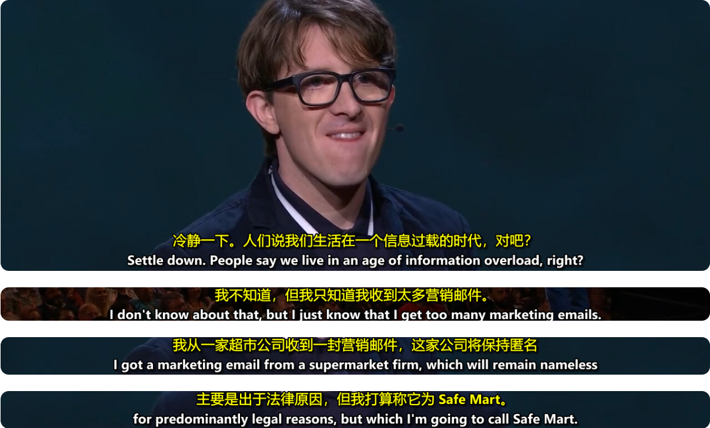

<div align="center">
  <br>
  <strong>Rust CLI 视频字幕处理工具：转录、分段、翻译、评估、烧制 / 软封装。</strong><br>
  <a href="https://github.com/deusjin/subforge/actions/workflows/ci.yml"></a>
  <a href="LICENSE"></a>
  <a href="Cargo.toml"></a><br>
  <a href="README.md">English</a> |
  <a href="README.zh-CN.md">简体中文</a>
</div>

基于 SOTA 学术研究的端到端管线：
- **SaT (EMNLP 2024)** 神经分段，F1=96.5
- **GEMBA-MQM** 质量评估 + 自动重翻
- **MAPS 术语提取** + 项目级翻译记忆
- **SubER (IWSLT 2022)** 字幕质量评测

<p align="center">
  
</p>

## 安装

支持 Linux / macOS / Windows。`subforge` 本体是 Rust CLI；任何平台如果没有下载预编译的 `subforge` / `subforge.exe`，从源码安装前都必须先安装 Rust 工具链。Python 依赖由 `subforge setup` 负责安装。

### 1. 安装前置工具

| 工具 | 用途 | Linux / macOS | Windows |
|------|------|---------------|---------|
| Rust 1.88+ | 编译 `subforge` 本体 | 见下方安装命令 | 见下方安装命令 |
| Python 3.9+ | faster-whisper / SaT / SubER 运行环境 | 系统包管理器或 python.org | `winget install Python.Python.3.12`，安装后确认 `python --version` 可用 |
| ffmpeg | 抽音频、烧制/封装字幕 | 见下一节 | 见下一节 |

```bash
# Linux / macOS
curl --proto '=https' --tlsv1.2 -sSf https://sh.rustup.rs | sh -s -- -y --profile minimal
```

Windows PowerShell:

```powershell
$env:RUSTUP_DIST_SERVER="https://rsproxy.cn"
$env:RUSTUP_UPDATE_ROOT="https://rsproxy.cn/rustup"

winget install --id Rustlang.Rustup --exact --force

rustup set profile minimal
rustup toolchain install stable
rustup default stable
cargo --version

mkdir $env:USERPROFILE\.cargo -Force
@"
[source.crates-io]
replace-with = "rsproxy"

[source.rsproxy]
registry = "sparse+https://rsproxy.cn/index/"
"@ | Set-Content -Encoding UTF8 $env:USERPROFILE\.cargo\config.toml
```

安装 Rust 后确认 `cargo` 可用：

```bash
cargo --version
```

如果提示找不到 `cargo`，关闭并重新打开终端。仍不行就检查 Cargo bin 目录是否在 PATH 中：

- Linux / macOS: `$HOME/.cargo/bin`
- Windows PowerShell: `$env:USERPROFILE\.cargo\bin`

### 2. 获取源码并编译二进制

```bash
git clone https://github.com/deusjin/subforge.git
cd subforge
cargo install --path .
```

安装完成后确认：

```bash
subforge --version
```

如果不想安装 Rust，需要先提供/下载对应平台的预编译二进制（Linux/macOS 为 `subforge`，Windows 为 `subforge.exe`），把它所在目录加入 PATH；之后仍然需要执行下面的 `ffmpeg`、`config.toml` 和 `subforge setup` 步骤。

### 3. 系统依赖：ffmpeg

ffmpeg 是核心依赖（抽音频 + 烧字幕），需单独安装：

```bash
sudo apt install ffmpeg            # Debian/Ubuntu
sudo dnf install ffmpeg            # Fedora
sudo pacman -S ffmpeg              # Arch
brew install ffmpeg                # macOS
winget install Gyan.FFmpeg         # Windows (或 choco/scoop install ffmpeg)
```

> 没装也没关系：用到 ffmpeg 时会报错并打印上面的安装命令，`subforge doctor` 也会提示。

### 4. 一键安装 Python 环境

`subforge setup` 会自动创建虚拟环境、升级 pip、安装全部管线依赖（faster-whisper、wtpsplit、transformers、huggingface_hub、subtitle-edit-rate）以及 PyTorch：

```bash
subforge setup                       # CPU 版（默认）
subforge setup --compute cu124       # CUDA 12.x GPU
subforge setup --compute cu128-nightly  # RTX 50 系列（Blackwell sm_120）
subforge setup --force               # 删除旧 venv 重建
```

Windows / macOS / Linux 命令完全一致——venv 的 `bin/` vs `Scripts\` 差异由 subforge 内部处理。

> 前置：系统需有 Python 3.9+。缺失时 `setup` 会打印对应平台的安装命令。

### 5. 复制配置模板

```bash
cp config.toml.example config.toml   # Linux/macOS
copy config.toml.example config.toml # Windows
```

`config.toml` 已 gitignored（含 api_key），不要提交。

### 6. 检查环境

```bash
subforge doctor
```

### 按需依赖说明

部分功能只在使用时才需要对应依赖，`setup` 已包含全部，单独安装见下：

| 功能 | 依赖 | 安装 |
|------|------|------|
| `subforge eval` | `subtitle-edit-rate` (suber) | `pip install subtitle-edit-rate` |
| `subforge model download` | `huggingface_hub` | `pip install huggingface_hub` |
| `translator=bing` | `curl` | 系统包管理器 |
| faster-whisper / SaT 分段 | torch + faster-whisper + wtpsplit | `subforge setup` |


## 用法

### 全流程

```bash
# 转录 + 翻译（不烧制）
subforge translate video.mp4

# 转录 + 翻译 + 硬烧字幕（默认）
subforge process video.mp4

# 转录 + 翻译 + 软封装字幕轨（无重编码，秒级出片）
subforge process video.mp4 --synth-mode soft

# 同时产生硬烧版和软封装版（双产物）
subforge process video.mp4 --synth-mode both

# 详细日志 / 静默
subforge process video.mp4 -v
subforge process video.mp4 -q

# 保留中间文件（默认会清理只剩最终产物）
subforge process video.mp4 --keep-intermediate

# process 接受所有 synthesize 的样式与编码 flag
subforge process video.mp4 \
  --font "Source Han Sans" --font-size 28 --outline-color 000000 \
  --encoder x265 --crf 22 --preset slow
```

### 单步

```bash
subforge transcribe video.mp4 --asr faster-whisper                       # → video.srt
subforge subtitle video.srt --translator google                          # → video_translated.srt
subforge synthesize video.mp4 --subtitle video_translated.srt            # → video_captioned.mp4
```

首次使用 `faster-whisper` 且本地模型不存在时，`subforge transcribe` / `translate` / `process` 会列出模型、显示简短说明、让你选择一个下载，并在下载时显示 HuggingFace 进度。非交互环境请提前运行 `subforge model download <模型名>`。

### GPU 选择

本地 `faster-whisper` 转录和 `nvenc` / `nvenc-hevc` 视频编码会使用 `cuda_gpu` 指定的默认 CUDA GPU。

```bash
subforge gpu                    # 探测 GPU 并交互选择默认卡
subforge gpu --set 1            # 非交互设置默认 CUDA GPU
subforge config get cuda_gpu    # 查看当前默认卡
subforge config set cuda_gpu "" # 清空；多 GPU 时下次运行会重新提示选择
```

运行时会先报告实际 GPU，例如：

```text
Whisper GPU: [0] NVIDIA GeForce RTX 5060 Laptop GPU
transcribing (device=auto via CUDA_VISIBLE_DEVICES=0)...
```

这里的 `device=auto` 是 faster-whisper 的设备策略；`CUDA_VISIBLE_DEVICES=0` 才是 subforge 固定到的物理 GPU 编号。

### 进度与耗时

耗时任务会持续输出进度，不会一直空等到阶段结束：

- 转录：显示选中的 GPU、faster-whisper 输出和运行中心跳。
- 翻译：按字幕条或 LLM batch 显示进度条。
- 合成：hard burn 时保留 ffmpeg 的 `frame/time/speed` 实时进度。

### 批量处理

只想要翻译后的 SRT，用 `batch translate`。想直接生成带字幕的视频，用 `batch process`。

先预览，不实际运行：

```bash
subforge batch translate videos/ -o out --dry-run
subforge batch process videos/ -o out --dry-run
```

确认输出计划没问题后，去掉 `--dry-run`：

```bash
subforge batch translate videos/ -o out
subforge batch process videos/ -o out --synth-mode soft
```

常用写法：

```bash
# 明确指定多个视频
subforge batch translate ep1.mp4 ep2.mp4 ep3.mp4 -o out

# 扫描子目录
subforge batch translate videos/ -o out --recursive

# 同时处理 2 个视频
subforge batch process videos/ -o out --jobs 2

# 已有最终产物也强制重跑
subforge batch process videos/ -o out --overwrite

# 写 JSON 报告，方便脚本检查成功/失败
subforge batch translate videos/ -o out --report batch-report.json
```

批量规则：

| 规则 | 行为 |
|------|------|
| 输入 | 接受视频文件和目录。目录默认只扫一层。 |
| 递归 | 加 `--recursive` 才会扫描子目录。 |
| 输出 | 不传 `-o` 时写到每个视频旁边；传 `-o DIR` 时写到这个输出目录下。 |
| 已有产物 | 默认跳过已有最终产物；加 `--overwrite` 强制重跑。 |
| 并发 | 默认 `--jobs 1`。只有确认 GPU / API 限流扛得住时再调高。 |
| 翻译记忆 | 未设置 `tm_dir` 时，batch 会为本批视频自动共享一个 `.subforge-tm`，保证系列视频术语更一致。 |
| 失败处理 | 单个视频失败后继续处理剩余视频；最后汇总失败项，并用非零退出码表示批次未完全成功。 |

全流程会汇报每个阶段和总耗时：

```text
[1/3] Transcribing completed in 42s
[2/3] Translating completed in 3m 18s
[3/3] Synthesizing completed in 1m 6s
Total elapsed: 5m 6s
```

### 字幕烧制 / 封装详细选项

```bash
# 模式
subforge synthesize video.mp4 --subtitle sub.srt --mode hard|soft|both

# 样式（仅 hard 模式生效）
subforge synthesize video.mp4 --subtitle sub.srt \
  --font "Source Han Sans" --font-size 24 \
  --font-color FFFFFF --outline-color 000000 --outline-width 3 \
  --position bottom-right --margin-v 40

# 编码（仅 hard 模式生效）
subforge synthesize video.mp4 --subtitle sub.srt \
  --encoder x265 --crf 22 --preset slow --max-bitrate 8M

# 范围裁剪（30 秒预览片）
subforge synthesize video.mp4 --subtitle sub.srt \
  --ss 60 --duration 30 -o preview.mp4

# force_style 原样透传
subforge synthesize video.mp4 --subtitle sub.srt \
  --style "FontName=Microsoft YaHei,FontSize=20,Bold=1"
```

| Flag | 取值 | 说明 |
|------|------|------|
| `--mode` | `hard` (默认) / `soft` / `both` | hard=重编码烧入；soft=stream-copy 封装独立轨；both=两份输出 |
| `--font` | 字体名 | 可含空格，逗号会被转空格（libass 限制） |
| `--font-size` | 像素 | |
| `--font-color` / `--outline-color` | RRGGBB hex | 自动转 libass 的 BGR 格式 |
| `--outline-width` | 像素 | |
| `--position` | `bottom` / `top` / `center` / `bottom-left` / `bottom-right` / `top-left` / `top-right` / `middle-left` / `middle-right` | 9 个对齐位置 |
| `--margin-v` | 像素 | 距画面边缘的垂直边距 |
| `--style` | force_style 字符串 | 原样透传，覆盖所有 `--font*` |
| `--encoder` | `x264` (默认) / `x265` / `nvenc` / `nvenc-hevc` / `qsv` / `videotoolbox` | `nvenc` 会使用 `cuda_gpu` 指定的默认 CUDA GPU |
| `--crf` | 0-51 | 越小越清晰；x264 默认 23，x265 默认 28 |
| `--preset` | `veryfast` / `fast` / `medium` / `slow` / `veryslow` | NVENC 自动 map 到 p1-p7 |
| `--max-bitrate` | `8M` / `5000k` | bufsize 自动设为 2 倍 |
| `--width-ratio` | 1-100 | 字幕占画面宽度百分比，自动转 libass `MarginL`/`MarginR`。推荐 90；留空 / 0 = libass 默认 |
| `--ss` / `--duration` | 秒数或 `HH:MM:SS[.mmm]` | 范围裁剪；无效格式会报错而非进 ffmpeg |

软封装容器要求：
- `.mp4` / `.m4v` / `.mov` → mov_text 字幕
- `.mkv` → SRT 字幕
- `.webm` → WebVTT 字幕（**且源视频必须已经是 VP8/VP9/AV1 + Vorbis/Opus**，否则用 `--mode hard` 或换 .mkv）

### 字幕质量评估

```bash
subforge eval my_output.srt -r reference.srt              # SubER + WER + BLEU + chrF + TER
subforge eval my_output.srt -r reference.srt -l zh        # 中日韩按字符分词
```

### 配置管理

```bash
subforge config show                              # 查看当前配置
subforge config set whisper_model medium          # 修改某项
subforge config get api_key                       # 仅显示前 4 位
subforge config path                              # 显示实际加载的 config.toml 位置
```

### 模型管理 / 缓存管理

```bash
subforge model list
subforge model download large
subforge model download            # 交互选择模型

subforge cache stats
subforge cache prune --days 30 --max-mb 500       # 按 LRU 淘汰
subforge cache clean
```

`subforge model list` 会显示模型大小、安装状态和适用场景。下载目标目录是 `.subforge/models/faster-whisper/<模型名>`，受 `data_dir` 配置影响。

## 配置文件位置（搜索顺序）

第一个命中的会被使用：

1. `--config <path>` 命令行参数
2. `$SUBFORGE_CONFIG` 环境变量
3. `<当前目录>/config.toml`（项目级，最常用）
4. `$XDG_CONFIG_HOME/subforge/config.toml`
5. `$HOME/.config/subforge/config.toml`

## 支持的后端

### ASR (语音识别)

| 后端 | 描述 | 配置 |
|------|------|------|
| `bijian` | Bilibili Bcut（免费，中文好） | 无需 key |
| `faster-whisper` | 本地 Whisper（推荐） | `whisper_model`, `whisper_device` |
| `whisper-api` | OpenAI 兼容 API | `whisper_api_model` + `asr_api_key`/`asr_base_url`（或回退 `api_key`/`base_url`） |
| `whisper-cpp` | whisper.cpp 本地推理 | `whisper_cpp_model` |

### 翻译

| 翻译器 | 描述 | 配置 |
|--------|------|------|
| `llm` | OpenAI 兼容 LLM（最佳质量） | `api_key`, `base_url`, `model` |
| `google` | Google 网页翻译（免费） | 无需 key |
| `bing` | Bing 翻译（免费） | 需要 `curl` |

### 分段

| 算法 | 描述 |
|------|------|
| `sat` | SaT 神经网络（默认，质量最佳） |
| `rule` | 规则分段（无 GPU/Python 时降级） |

## 字幕翻译质量管线（仅 `translator=llm`）

```
   源 SRT
     │
     ├──[1]──> MAPS 术语提取（一次性）
     │           │
     │           ▼
     │      glossary.jsonl ←─── 术语表（项目级持久化）
     │           │
     ├──[2]──> Two-phase batch 翻译
     │         ├─ Phase 1: 顺序 3 个 batch（建立 moving window 上下文）
     │         └─ Phase 2: 并发 wave（每 wave 之间滑动窗口前进）
     │           │
     │           ▼
     ├──[3]──> GEMBA-MQM 质量评估（可独立 endpoint：qe_api_key/qe_base_url）
     │           │
     │           ▼
     ├──[4]──> Targeted Refine（低于 refine_threshold 的自动重翻）
     │           │
     │           ▼
     └──[5]──> 翻译记忆 (memory.jsonl) ←─── 跨次复用
```

## 翻译记忆（TM）路径规则

`.subforge-tm/` 默认放在**原始视频文件的父目录**。

| 命令 | TM 锚点 |
|------|---------|
| `subforge process video.mp4` | 视频所在目录 |
| `subforge translate video.mp4` | 视频所在目录 |
| `subforge subtitle video.srt`（直接调用） | SRT 所在目录 |

要在多段视频之间共享 TM，请显式设置 `tm_dir`：

```bash
subforge config set tm_dir /shared/path/.subforge-tm
```

## 配置项

详见 `subforge config show` 和 `config.toml.example` 内的注释。关键项：

| Key | 默认 | 说明 |
|-----|------|------|
| `asr` | `bijian` | 转录引擎 |
| `whisper_model` | `base` | Whisper 模型 |
| `whisper_device` | `auto` | `auto`/`cuda`/`cpu` |
| `cuda_gpu` | (空) | 默认 CUDA GPU 编号；供 faster-whisper 和 NVENC 使用。运行 `subforge gpu` 可交互选择；空且多 GPU 时会提示选择 |
| `segmenter` | `sat` | 分段算法 |
| `max_chars_per_cue` | 100 | 单段最大字符数 |
| `target_chars_per_cue` | 60 | 偏好字符数 |
| `polish_with_llm` | false | LLM 边界润色（额外 API 调用） |
| `chained_translation` | true | 顺序翻译（真 moving window）/ false=并发 wave |
| `translator` | `bing` | 翻译器 |
| `target_language` | `zh-Hans` | 目标语言 |
| `layout` | `target-above` | 布局：target-above / source-above / target-only / source-only |
| `target_color` / `source_color` | (空) | 双行各自颜色 RRGGBB hex；空 = libass 默认 |
| `model` | `gpt-4o-mini` | LLM 模型 |
| `thread_num` / `batch_size` | 3 / 7 | 翻译并发线程 / LLM 每批字幕条数（必须 ≥ 1） |
| `quality_estimation` | true | GEMBA 评分（关闭后 TM 仍累积） |
| `refine` | true | 低分自动重翻 |
| `refine_threshold` | 70 | 重翻阈值 (0-100) |
| `asr_api_key` / `asr_base_url` | (空) | ASR 专用 LLM endpoint，留空回退 |
| `qe_api_key` / `qe_base_url` | (空) | QE 专用 LLM endpoint，留空回退 |
| `polish_api_key` / `polish_base_url` / `polish_model` | (空) | polish 专用 endpoint，留空回退 |
| `hf_model_repo_prefix` | `Systran` | `subforge model download` 用的 HF 组 |

### 烧制默认值（CLI flag 优先于这些）

`subforge synthesize` 和 `subforge process` 的样式 / 编码 flag 都可以在 config 里设默认值。命令行没有显式指定时使用这里的值；指定了就以命令行为准。

| Key | 类型 | 说明 |
|-----|------|------|
| `synth_mode` | string | `hard` (默认) / `soft` / `both`；soft 不指定输出时默认生成 `.mkv`，保留 SRT 字幕轨以提升播放器兼容性 |
| `synth_font` | string | 字体名（如 "Source Han Sans"） |
| `synth_font_size` | u32 | 字号像素，0 = libass 默认 |
| `synth_font_color` / `synth_outline_color` | RRGGBB hex | |
| `synth_outline_width` / `synth_margin_v` | u32 | 像素，0 = libass 默认 |
| `synth_position` | string | `bottom` / `top-right` / 等 9 向 |
| `synth_encoder` | string | `x264` / `x265` / `nvenc` / ... |
| `synth_crf` | u8 | 0-51，0 = 编码器默认 |
| `synth_preset` | string | `veryfast` / `fast` / `medium` / `slow` / `veryslow` |
| `synth_max_bitrate` | string | `8M` / `5000k` |
| `synth_width_ratio` | u8 | 字幕占画面宽度百分比（1-100），0 = libass 默认；推荐 90 |

例：固定使用 x265 + slow preset + 自家字体，每次 `subforge process video.mp4` 都自动应用：

```bash
subforge config set synth_encoder x265
subforge config set synth_crf 22
subforge config set synth_preset slow
subforge config set synth_font "Source Han Sans"
subforge config set synth_font_size 24
subforge config set synth_outline_color 000000
```

环境变量 `OPENAI_API_KEY` 和 `OPENAI_BASE_URL` 优先于 config.toml。

## 性能

| 视频长度 | CPU (faster-whisper small) | GPU (CUDA) |
|----------|----------------------------|------------|
| 6 分钟 | ~2 分钟 | ~50 秒 |
| 1 小时 | ~20 分钟 | ~5 分钟 |

GPU 加速对大模型（`medium`/`large`/`turbo`）效果更明显。

软封装（`--mode soft`）跳过视频重编码，1 小时视频约 0.5-2 秒出片。

## 目录结构

```
.subforge/                           # 数据目录（可通过 data_dir 配置；已 gitignored）
├── cache/                        # 转录/翻译输出缓存（LRU 淘汰）
├── models/faster-whisper/        # Whisper 模型
└── tools/faster-whisper-cli/venv # Python 虚拟环境

.subforge-tm/                        # 项目级翻译记忆（视频目录或上层；已 gitignored）
├── glossary.jsonl                # MAPS 提取的术语表
├── memory.jsonl                  # 翻译记忆（带 GEMBA 分数）
└── .lock                         # 跨进程并发写入互斥锁（fs4）

config.toml                       # 主配置（已 gitignored，请从 config.toml.example 拷贝）
config.toml.example               # 配置模板
```

## 开发

```bash
cargo build --release            # 主二进制
cargo test                       # 单元测试 + ffmpeg 集成测试 (160+ tests)
cargo bench --bench client_reuse # HTTP 客户端复用基准
cargo clippy --all-targets       # lint
```

### Python sidecar（faster-whisper 路径）

`scripts/transcribe_segment.py` 在编译期通过 `include_str!` **嵌入到二进制**。
仓库里保留磁盘版本是为了方便阅读，**修改后必须 `cargo build` 重新编译才会生效**。`subforge doctor` 会比对磁盘版与嵌入版是否同步。

### 安全

- `config.toml` 已加入 `.gitignore`，永远不要 commit。
- CI 中启用了 `gitleaks` 扫描常见 API key / Bearer token / JWT。
- 切换 key 不会失效缓存（key 只用于鉴权，不影响输出）。

## 常见问题排查 (Troubleshooting)

| 症状 | 原因 / 解决 |
|------|-------------|
| `cargo` / `rustup` not found | 当前系统没安装 Rust 工具链，或 PATH 未刷新。按[安装前置工具](#1-安装前置工具)安装后重新打开终端；Linux/macOS 检查 `$HOME/.cargo/bin`，Windows 检查 `$env:USERPROFILE\.cargo\bin`。 |
| Windows 编译时报 linker / `link.exe` 错误 | Rust MSVC 工具链缺 Visual Studio Build Tools。运行 `winget install Microsoft.VisualStudio.2022.BuildTools`，安装 C++ build tools 后重试。 |
| `ffmpeg not found` | 未安装 ffmpeg。按错误提示或上面[系统依赖](#3-系统依赖ffmpeg)章节安装；`subforge doctor` 会打印对应平台命令。 |
| `python not found` / 缺 faster-whisper 等包 | 没建 venv 或依赖没装齐。运行 `subforge setup`（GPU 加 `--compute cu124`）。 |
| faster-whisper 首次运行提示选择模型 | 当前 `whisper_model` 没有下载。按提示选择，或先运行 `subforge model download turbo` / `subforge model download medium`。 |
| GPU 没被使用（CUDA available 为 ✗） | 装的是 CPU 版 torch。用 `subforge setup --compute cu124 --force` 重装；RTX 50 系列用 `cu128-nightly`。 |
| 多张 GPU 想固定默认卡 | 运行 `subforge gpu` 交互选择，或 `subforge gpu --set 1` / `subforge config set cuda_gpu 1`。 |
| RTX 50 系列报 `sm_120` 不支持 | Blackwell 需 nightly：`subforge setup --compute cu128-nightly --force`。 |
| `subforge eval` 报 suber 缺失 | `pip install subtitle-edit-rate`（或 `subforge setup` 已含）。 |
| `translator=bing` 报 curl 失败 | 安装 curl（系统包管理器）。 |
| 改了 `scripts/transcribe_segment.py` 不生效 | 该脚本编译期嵌入二进制，改完需 `cargo install --path .` 重装；`subforge doctor` 会提示是否同步。 |
| Windows 下找不到 `python` | 安装时勾选 “Add Python to PATH”，或 `winget install Python.Python.3.12`。 |

更全面的环境自检：`subforge doctor`。

## 学术依据

- Frohmann et al. **Segment Any Text** (EMNLP 2024 Main): 分段
- McCarthy et al. **Long-Form Speech Translation** (Findings of EMNLP 2023): LLM 边界润色
- **GEMBA-MQM** (WMT 2023): 质量评估
- **MAPS** (Kim et al. WMT 2024): 术语提取
- **SubER** (Wilken et al. IWSLT 2022): 字幕评测指标

## 社区 / 友链

本项目在 LINUX DO 社区进行开源推广，感谢社区佬友的交流、反馈与建议。

- [LINUX DO](https://linux.do/)

## License

MIT
